# Example of a self-signed certificate
In this repository, I suggest looking at options for working with self-signed certificates. 
If you find any errors or want to suggest an improvement, please, [make an issue](https://github.com/mrt1m/self-signed-certificate/issues) in a current repository

## Requirements

- Docker version 25.0.5

## Quick guide

0) Copy env and build openssl image
    ```sh
    cp .env.example .env
    make openssl-build-image
    ```
   
1) Create root certificate chain, server certificate, user certificates and configuration for nginx
    ```sh
    make step-create_all_certs-and-nginx_configs step-run_nginx
    ```
   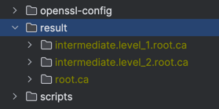

2) Run tests to check HTTPS and connections with the client certificate
    ```sh
    make step-run_tests
    ```
   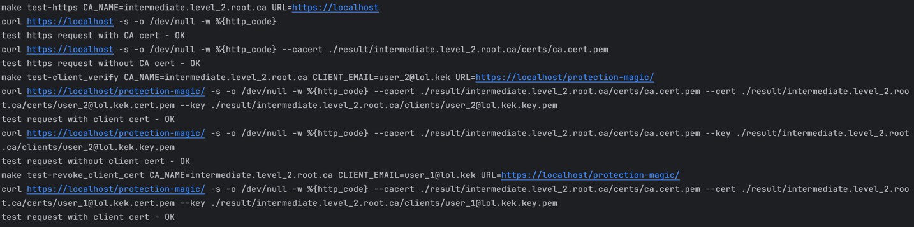

3) Check links in browser
-  https://localhost/
-  https://localhost/protection-magic/  
   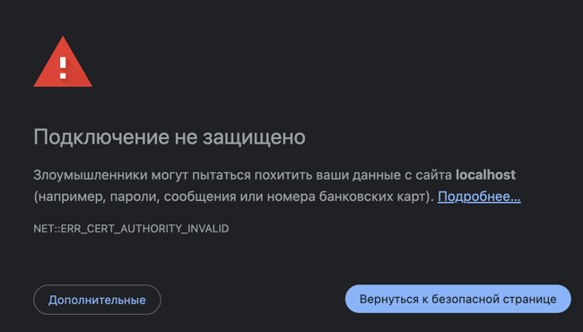

4) Import intermediate CA
    <details>
      <summary>macOS</summary>
    
      ```sh
      make import-macos-ca CA_NAME=intermediate.level_2.root.ca
      ```
    </details>

5) Check links in browser
-  https://localhost/  
   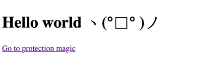
-  https://localhost/protection-magic/  
   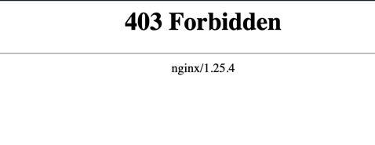

6) Import client certificates

    <details>
      <summary>macOS</summary>
    
      ```sh
      make import-macos-client CA_NAME=intermediate.level_2.root.ca CLIENT_EMAIL=user_1@lol.kek
      make import-macos-client CA_NAME=intermediate.level_2.root.ca CLIENT_EMAIL=user_2@lol.kek
      ```
    </details>

7) Re-enter the OS profile so that the system selects user certificates

8) Run nginx
    ```sh
    make step-run_nginx
    ```

9) Check links in browser incognito mode

> [!IMPORTANT]
> Remember, if you want to change the user certificate, you need to restart the browser

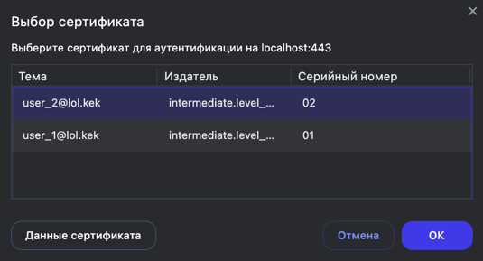

- Don't select a user
  -  https://localhost/  
     
  -  https://localhost/protection-magic/  
     
- Select user_1 - this user's certificate has been revoked, so any page will return a 400 Bad Request
   -  https://localhost/
   -  https://localhost/protection-magic/  
      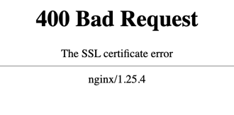
- Select user_2 - this user's certificate is active
   -  https://localhost/  
      
   -  https://localhost/protection-magic/  
      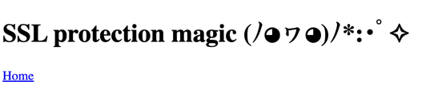

10) Now in the OS settings we will see the following certificates
    <details>
      <summary>macOS</summary>

      1) open keychain  
         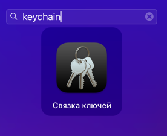
      2) certificates  
         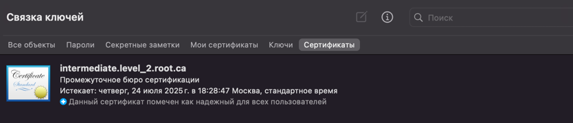
         
         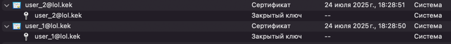
      3) keychains  
         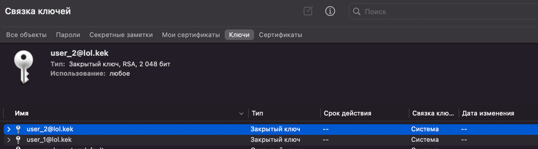
   </details>

---

## Task lists

- [ ] Add import commands for Windows and Linux
- [ ] Add documentation
- [ ] Add openssl OCSP example
